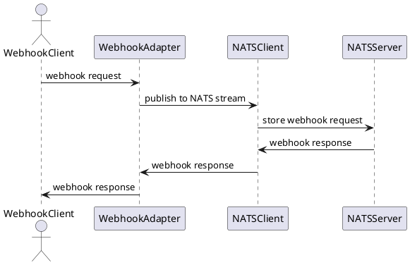
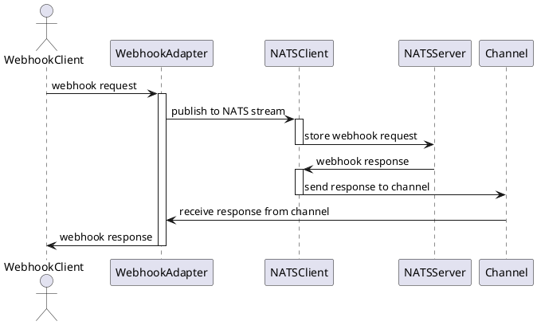

# Architecture

The application is designed to be a simple webhook adapter that can be used to connect different systems. It is built using Go and uses NATS for message brokering.

## Components

### Webhook Adapter

The webhook adapter is the main component of the application. It listens for webhook requests on a REST API and publishes them to NATS.

### NATS Client

The NATS client is responsible for connecting to the NATS server and publishing messages to the NATS stream.

### NATS Stream

The NATS stream is a stream of messages that are published to the NATS server. The webhook adapter publishes the webhook requests to the NATS stream.

### NATS Server

The NATS server is the server that the NATS client connects to. It is responsible for storing the messages in the NATS stream.

## Flow

Flow diagram

1. The webhook adapter receives a webhook request from a webhook client.
2. The webhook adapter publishes the webhook request to the NATS stream.
3. The NATS client (Function) subscribes to the NATS stream and receives the webhook request.
4. The NATS client (Function) publishes the webhook response to the NATS server.
5. The NATS server stores the webhook response in the NATS stream.
6. Webhook adapter recieves the webhook response from the NATS stream.
7. Webhook adapter returns the webhook response to the webhook client.

During the whole process, the webhook adapter is holding connection to the webhook client open, so the client have to wait for the webhook response.
This is not ideal, but it is a simple solution to the problem.
Because webhook adapter holds connection to the webhook client open, those connections are kept in memory, and will be dropped if the webhook adapter is restarted. 

Carefully processing SIGTERM and propagating it to the webhook clients can mitigate this problem.

Since most of the time webhook is waiting, channels are used to unblock the webhook client and allow to process multiple webhook requests asynchronously.
To know which webhook request is completed by the Function, a map is used to store the request id and the corresponding channel.
When the webhook response is received, the webhook adapter can find the corresponding channel and write the response to the channel.
The webhook client can read the response from the channel and return it to the client.

